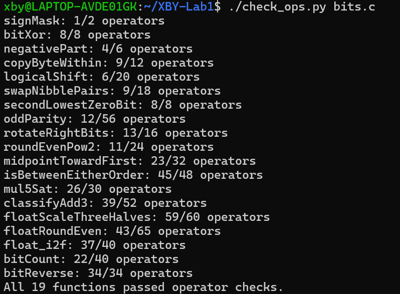
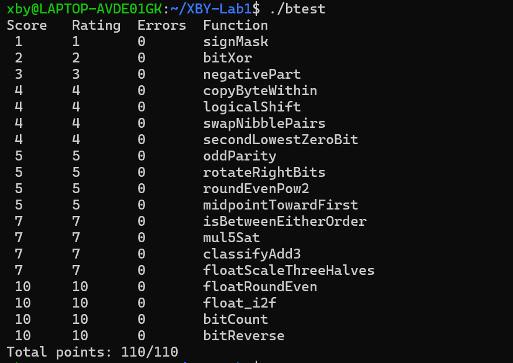

# ICS Lab1: DataLab 实验报告

姓名：徐邦予
学号：25300700058

## 一、规则检查截图

## 二、完整测试截图

## 三、各函数实现思路

### P1 signMask

返回最高位为 1 的掩码。`1 << 31` 即可得到 `0x80000000`。

### P2 bitXor

只能用 `~` 和 `&`。利用 `x ^ y = ~(~(x & ~y) & ~(~x & y))` 的等价形式实现异或。

### P3 negativePart

`x >> 31` 在 x 为负数时得到全 1，非负时得到 0。`~x + 1` 是 `-x`。两者按位与：负数返回 `-x`，非负返回 0。

### P4 copyByteWithin

把 src 字节左移到 dst 位置，同时用掩码把 x 的 dst 字节清零，最后合并。

### P5 logicalShift

`x >> n` 是算术右移，高位会补符号位。构造掩码 `~(((1 << 31) >> n) << 1)` 把高 n 位清零，得到逻辑右移。

### P6 swapNibblePairs

构造掩码保留每个字节的低 4 位，低 4 位左移 4 位，高 4 位右移 4 位（用 `(x >> 4) & mask` 避免符号位污染），最后合并。

### P7 secondLowestZeroBit

`~x` 让 0 变成 1。最低的 0 位就是 `~x` 中最低的 1 位，用 `a & (~a+1)` 取出后消掉，再取一次最低 1 位，就是第二个 0 的位置。

### P8 oddParity

把 32 位两两异或、逐步折叠（16、8、4、2、1），最后第 0 位是所有位的异或。题目要求偶数个 1 返回 1，所以取反后保留最低位。

### P9 rotateRightBits

循环右移 n 位 = 右移 n 位 + 左移 (32−n) 位。`sn = n & 31` 取模，右移部分用掩码清掉符号位，再与左移部分合并。

### P10 roundEvenPow2

先取半程 `half = 1 << (n-1)`，商 `q = x >> n`。根据 q 的奇偶决定加不加半程：偶数不加，奇数加。再右移 n 位再左移 n 位，得到 2^n 的倍数。

### P11 midpointTowardFirst

用 `(x & y) + ((x ^ y) >> 1)` 计算不溢出的中点。若 x+y 是奇数，需要根据 x 和 y 的符号决定向 x 还是向 y 偏移，这里用符号位比较得出偏移方向。

### P12 isBetweenEitherOrder

先判断 a、b 的符号是否相同，用减法 `a - b` 判断大小，确定实际的上下界。再分别判断 x 是否在界内，合并结果。

### P13 mul5Sat

先算 `t = x << 2`，再算 `r = t + x`。检查左移是否溢出、加法是否溢出。若溢出，根据 x 的符号返回 INT_MAX 或 INT_MIN，否则返回 r。

### P14 classifyAdd3

分两步：先算 `s1 = x + y`，再算 `s2 = s1 + z`。统计每一步的正溢出和负溢出次数，净溢出 K = 正溢出次数 − 负溢出次数。K≥1 返回 1，K≤−1 返回 −1，否则返回 0。

### P15 floatScaleThreeHalves

拆分符号、阶码、尾数。处理 NaN、无穷、0 直接返回。把尾数乘以 3，调整指数。对结果做规格化，用就近舍入到偶数处理尾数。处理下溢（变成非规格化或 0）和上溢（变成无穷）。

### P16 floatRoundEven

拆分符号、阶码、尾数。NaN、无穷直接返回。阶码为 0 时返回带符号的 0。根据指数 E 判断需要保留多少位小数。整数部分 `ipart` 加上舍入判断（余数大于半程，或等于半程且末位为奇数时进位）。最后重新规格化返回。

### P17 float_i2f

处理符号，取绝对值。找到最高位的位置 p，计算阶码。若 p ≤ 23，尾数左移对齐；否则右移，并对被丢弃的部分做就近舍入到偶数。处理进位导致的阶码增加和上溢。

### P18 bitCount

用分治法统计 1 的个数：先两两一组统计，再四四一组、八八一组、十六十六一组，最后合并。每步用掩码分组，加法合并。

### P19 bitReverse

用分治法反转位：先交换相邻 1 位，再交换相邻 2 位、4 位、8 位，最后交换高低 16 位。每步用掩码分组，移位后合并。

## 四、实验感受

本次实验让我对位运算和二进制表示有了更深入的理解。
整数题的限制（只能用特定运算符、常量只能 0–255、不能写控制语句）迫使我用纯位运算解决问题，做完之后对补码、移位、掩码的掌握明显提升。
浮点题让我从位级角度理解了 IEEE 754 单精度格式的符号位、阶码和尾数的含义，以及舍入到偶数的处理方式。

